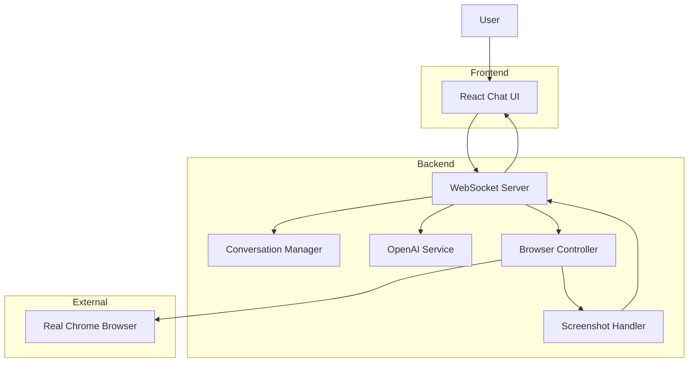

# 🤖 Conversational Browser Control Agent

> An end-to-end AI agent that **controls a real Chrome browser** through natural-language conversation and visibly sends emails from the Gmail web UI.  
> **Absolutely no Gmail API, SMTP, or indirect form requests** are used—every action is pure Playwright-driven automation that a human could replicate by hand.

## 📑 Table of Contents
1. [✨ Key Features](#-key-features)  
2. [🧩 System Architecture](#-system-architecture)  
3. [🛠️ Technology Stack](#️-technology-stack)  
4. [⚡ Setup Guide](#-setup-guide)  
5. [🚀 Running the Project](#-running-the-project)  
6. [🔎 How It Works – End-to-End Flow](#-how-it-works--end-to-end-flow)  
7. [🖼️ Screenshots / Demo](#-screenshots--demo)  
8. [🛡️ Troubleshooting](#-troubleshooting)  
9. [🧠 Notable Challenges & Solutions](#-notable-challenges--solutions)  
10. [📜 License & Credits](#-license--credits)

## ✨ Key Features
- 🗣️ **Natural-language commands** (e.g., "Email my manager about Monday's leave")
- 🤖 **Dynamic info gathering**: prompts for any missing details
- 🕹️ **Playwright-powered browser control**:
  - Opens Chrome, navigates to Gmail
  - Logs in, handles "Sign-in faster / Passkey" dialogs
  - Writes & sends the email, taking a screenshot after every major step
- 🖼️ **Inline visual feedback**: screenshots appear directly in the chat stream
- 📝 **AI-generated subject & body**: OpenAI crafts professional-sounding messages
- 🔒 **100% Gmail-UI driven**—no hidden programmatic email endpoints
- 🛡️ **Robust error handling**: fallback selectors, filename sanitization, and clear user feedback

## 🧩 System Architecture



> **Every arrow from the Browser Controller onward represents real clicks, typing, and waits inside a live browser session—providing complete transparency and human-level capability.**

## 🛠️ Technology Stack

| Layer               | Tech            | Rationale |
|---------------------|-----------------|-----------|
| 💻 Frontend         | React (Vite)    | Lightweight SPA, fast dev-reload, native PWA support |
| 🔄 Realtime Channel | WebSocket       | Pushes status & screenshots with sub-second latency |
| 🐍 Backend Runtime  | Python 3.10     | Rapid prototyping, rich ecosystem for AI & automation |
| 🕹️ Browser Control | Playwright      | Modern, fast, resilient selectors, Chrome support |
| 🤖 AI Content       | OpenAI GPT-4    | Generates subject lines & polished email bodies |
| 🔑 Secrets Mgmt     | python-dotenv   | Keeps API keys & credentials outside the codebase |

## ⚡ Setup Guide

### 1️⃣ Clone the Repo
```bash
git clone https://github.com/vijayshreepathak/Full-Stack-Conversational-Browser-Control-Agent.git
cd Full-Stack-Conversational-Browser-Control-Agent
```

### 2️⃣ Backend Setup
```bash
cd backend
pip install -r ../requirements.txt
playwright install  # downloads Chrome driver
```

Create `backend/.env`:
```dotenv
OPENAI_API_KEY=sk-xxxxxxxxxxxxxxxxxxxxxxxxxxxxxxxxxxxxxxxx
```

### 3️⃣ Frontend Setup
```bash
cd ../frontend
npm install
```

## 🚀 Running the Project

### Start Backend WebSocket Server
```bash
cd backend
python websocket_server.py
```

### Start React Frontend
```bash
cd ../frontend
npm start
```

Open your browser and navigate to: **http://localhost:3000**

| Service            | Port   | URL |
|--------------------|--------|-----|
| Backend WebSocket  | **8765** | `ws://localhost:8765` |
| React Dev-Server   | **3000** | `http://localhost:3000` |

## 🔎 How It Works – End-to-End Flow

### Step 1: User Input
User types: `"Send a leave request to my manager for 14-16 Aug."`

### Step 2: Information Gathering
The **Conversation Manager** extracts intent & missing information:
- Gmail credentials (email/password)
- Manager's email address
- Leave dates and reason

### Step 3: AI Content Generation
**OpenAI GPT-4** crafts:
- Professional subject line
- Well-formatted email body

### Step 4: Browser Automation
**Browser Controller** performs these actions:
1. 🚀 Launch Chrome with Playwright
2. 🌐 Navigate to `https://mail.google.com`
3. 🔐 Handle login (including optional passkey prompts)
4. ✍️ Open **Compose** window
5. 📧 Fill **To** → **Subject** → **Body** fields
6. 📤 Click **Send** (with Ctrl+Enter fallback)
7. 📸 Capture screenshot after each action

### Step 5: Visual Feedback
Screenshots & status updates stream back to the chat UI in real-time.

> **No APIs, no SMTP, no hidden form-posts—just visible browser automation.**

## 🖼️ Screenshots / Demo

| Step                        | Description                   |
|-----------------------------|-------------------------------|
| **Gmail Homepage**          | Initial Gmail login page     |
| **Email Entered**           | User email filled in         |
| **Password Entered**        | Password authentication       |
| **Inbox Loaded**            | Gmail inbox successfully loaded |
| **Compose Window**          | Email composition dialog     |
| **Recipient Filled**        | To field completed           |
| **Subject Filled**          | Subject line added           |
| **Body Filled**             | Email body content added     |
| **Email Sent**              | Confirmation of successful send |

**Note**: All screenshots are captured automatically and displayed inline in the chat interface.

## 🛡️ Troubleshooting

### Common Issues and Solutions

| Issue                        | Solution                                                                 |
|------------------------------|--------------------------------------------------------------------------|
| **Gmail asks for 2FA/phone** | Use a test account without 2FA, or complete the prompt manually once     |
| **Email stuck in Drafts**    | Check selector updates in `browser_controller.py` - Gmail may have changed UI |
| **Screenshots not showing**  | Confirm WebSocket connection (`ws://localhost:8765`) isn't blocked by firewall |
| **OpenAI errors**            | Verify `OPENAI_API_KEY` in `.env`, check usage quota and model availability |
| **Port already in use**      | Change ports in configuration or kill existing processes               |
| **Chrome not found**         | Ensure Chrome is installed at the specified path in `browser_controller.py` |

### Debug Steps
1. Check backend console for error messages
2. Verify `.env` file is in the correct location
3. Ensure all dependencies are installed
4. Check screenshot files in the project directory for visual debugging

## 🧠 Notable Challenges & Solutions

### Technical Challenges

| Challenge                        | Solution Implemented                                                     |
|-----------------------------------|--------------------------------------------------------------------------|
| **Frequent Gmail DOM changes**    | Multiple fallback selectors + fail-fast screenshots for debugging        |
| **Subject text in To field**      | After filling To field, script presses **Tab** to create recipient chip |
| **Windows filename errors**       | Sanitization function strips illegal characters across operating systems |
| **Network timeouts**             | Adaptive waits with generous timeouts and retry logic                   |
| **User transparency**             | Inline images in chat - no "black-box" actions                         |
| **Error handling**               | Comprehensive try-catch blocks with descriptive error messages           |

### Design Decisions

- **Why Playwright over Selenium?** Modern API, better performance, native async support
- **Why WebSocket over HTTP polling?** Real-time updates, lower latency, better user experience
- **Why React over vanilla JS?** Component reusability, state management, developer experience
- **Why OpenAI over local models?** Reliability, quality, and faster development cycle

## 📁 Project Structure

```
Full-Stack-Conversational-Browser-Control-Agent/
├── backend/
│   ├── websocket_server.py        # Main WebSocket server
│   ├── browser_controller.py      # Playwright automation logic
│   ├── conversation_manager.py    # Chat flow management
│   ├── ai_integration.py          # OpenAI API integration
│   ├── screenshot_handler.py      # Screenshot capture/processing
│   └── .env                       # Environment variables
├── frontend/
│   ├── src/
│   │   ├── components/
│   │   │   ├── ChatInterface.jsx  # Main chat UI
│   │   │   ├── MessageBubble.jsx  # Individual messages
│   │   │   └── ScreenshotDisplay.jsx # Screenshot rendering
│   │   ├── services/
│   │   │   └── websocket_client.js # WebSocket communication
│   │   └── App.jsx                # Main application
│   ├── public/
│   └── package.json
├── requirements.txt               # Python dependencies
├── README.md                     # This file
└── screenshots/                  # Generated screenshots
```

## 🔐 Security Considerations

- **Credentials**: Never commit real credentials to version control
- **Test Accounts**: Use dedicated test Gmail accounts for development
- **Environment Variables**: Store sensitive data in `.env` files
- **Network Security**: Run on localhost for development, use HTTPS in production
- **API Keys**: Regularly rotate OpenAI API keys

## 🚧 Future Enhancements

- [ ] Support for other email providers (Outlook, Yahoo)
- [ ] Multi-language support
- [ ] Email templates and scheduling
- [ ] Advanced error recovery mechanisms
- [ ] Integration with calendar applications
- [ ] Voice command support
- [ ] Mobile-responsive design improvements

## 📜 Credits


Built with ❤️ by **Vijayshree Pathak**

### Special Thanks

- **Microsoft Playwright Team** – for rock-solid automation tools
- **OpenAI** – for world-class language models  
- **Proxy Convergence AI** – inspirational UX reference
- **React Team** – for the amazing frontend framework

### Contributing

1. Fork the repository
2. Create a feature branch
3. Make your changes
4. Add tests if applicable
5. Submit a pull request

## 📞 Contact & Support

For questions, issues, or contributions:
- GitHub Issues: [Create an issue](https://github.com/vijayshreepathak/Full-Stack-Conversational-Browser-Control-Agent/issues)
- Email: vijayshreepathak@example.com

> *"Real agents don't call APIs, they move pixels."*

**⭐ Star this repo if you found it helpful!**
