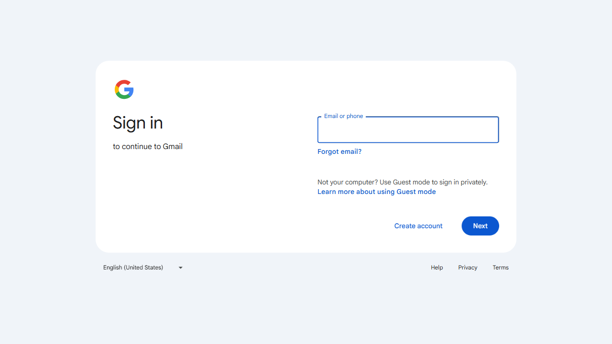
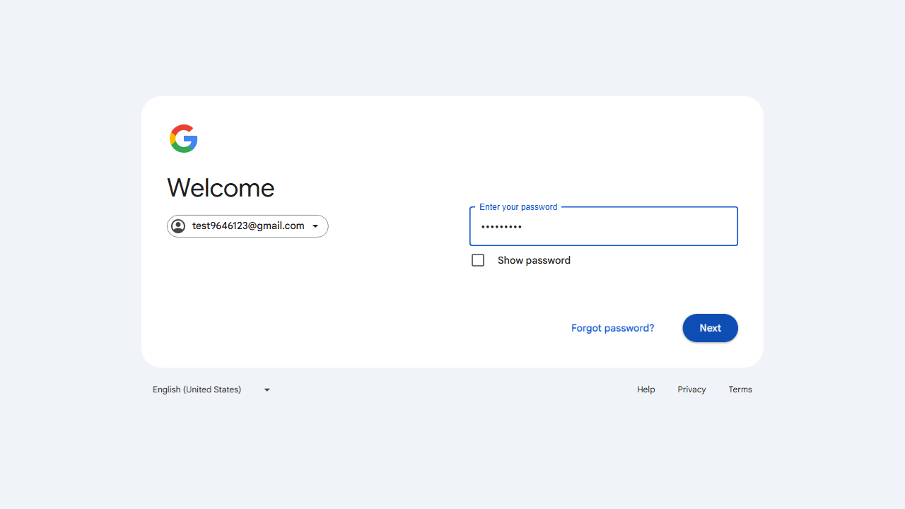
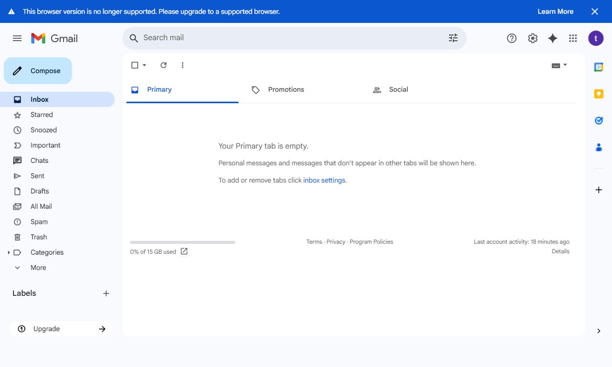
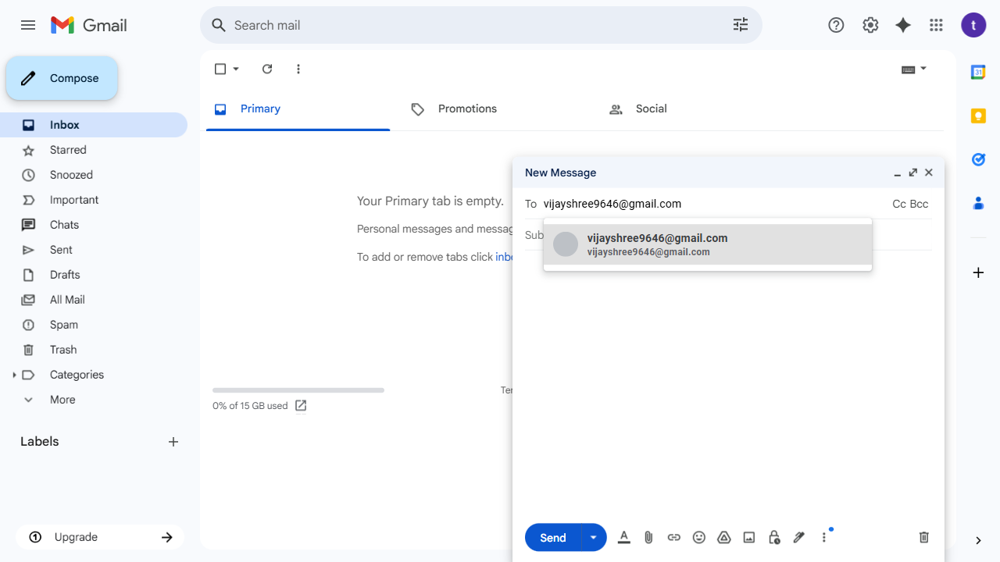
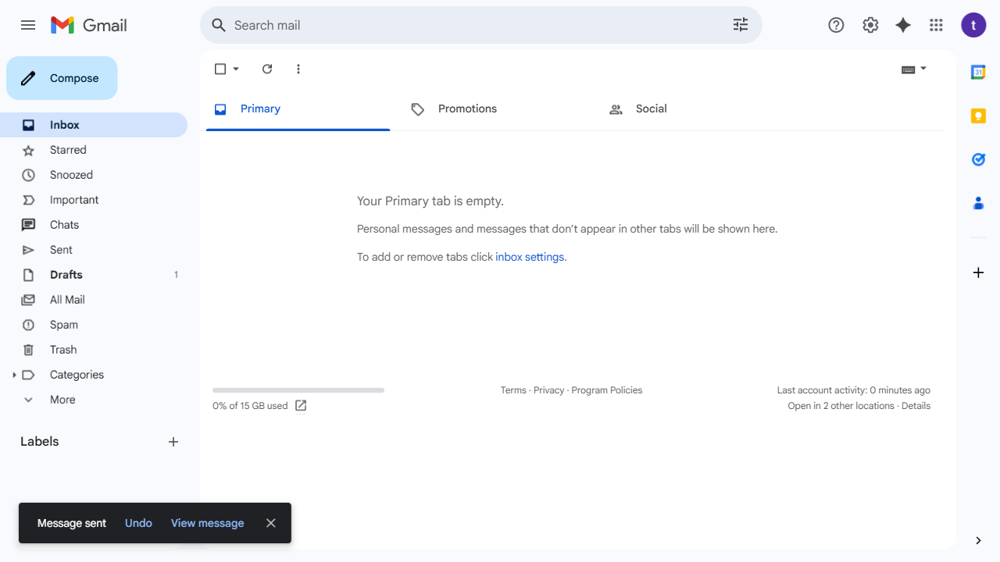

# 🤖 Conversational Browser Control Agent

> An end-to-end AI agent that **controls a real Chrome browser** through natural-language conversation and visibly sends emails from the Gmail web UI.  
> **Absolutely no Gmail API, SMTP, or indirect form requests** are used—every action is pure Playwright-driven automation that a human could replicate by hand.

---

## 📑 Table of Contents
1. [✨ Key Features](#-key-features)  
2. [🧩 System Architecture](#-system-architecture)  
3. [🛠️ Technology Stack](#️-technology-stack)  
4. [⚡ Setup Guide](#-setup-guide)  
5. [🚀 Running the Project](#-running-the-project)  
6. [🔎 How It Works – End-to-End Flow](#-how-it-works--end-to-end-flow)  
7. [🖼️ Screenshots / Demo](#-screenshots--demo)  
8. [🛡️ Troubleshooting](#-troubleshooting)  
9. [🧠 Notable Challenges & Solutions](#-notable-challenges--solutions)  
10. [📜 License & Credits](#-license--credits)

---

## ✨ Key Features
- 🗣️ **Natural-language commands** (e.g., “Email my manager about Monday’s leave”)
- 🤖 **Dynamic info gathering**: prompts for any missing details
- 🕹️ **Playwright-powered browser control**:
  - Opens Chrome, navigates to Gmail
  - Logs in, handles “Sign-in faster / Passkey” dialogs
  - Writes & sends the email, taking a screenshot after every major step
- 🖼️ **Inline visual feedback**: screenshots appear directly in the chat stream
- 📝 **AI-generated subject & body**: OpenAI crafts professional-sounding messages
- 🔒 **100% Gmail-UI driven**—no hidden programmatic email endpoints
- 🛡️ **Robust error handling**: fallback selectors, filename sanitization, and clear user feedback

---

## 🧩 System Architecture

```mermaid
flowchart TD
    subgraph User Side
        A[🧑 User]
    end
    subgraph Frontend
        B[💬 React Chat UI]
    end
    subgraph Backend
        C[🔌 WebSocket Server]
        D[🧠 Conversation Manager]
        E[🤖 OpenAI Service]
        F[🕹️ Browser Controller (Playwright)]
        H[📸 Screenshot Handler]
    end
    G[🌐 Real Chrome Browser]

    A -- Chat --> B
    B -- WebSocket --> C
    C --> D
    C --> E
    C --> F
    F --> G
    F --> H
    H -- Base64 Screenshot --> C
    C -- Status + Images --> B
```

> **Every arrow from the Browser Controller onward represents real clicks, typing, and waits inside a live browser session—providing complete transparency and human-level capability.**

---

## 🛠️ Technology Stack

| Layer               | Tech            | Rationale |
|---------------------|-----------------|-----------|
| 💻 Frontend         | React (Vite)    | Lightweight SPA, fast dev-reload, native PWA support |
| 🔄 Realtime Channel | WebSocket       | Pushes status & screenshots with sub-second latency |
| 🐍 Backend Runtime  | Python 3.10     | Rapid prototyping, rich ecosystem for AI & automation |
| 🕹️ Browser Control | Playwright      | Modern, fast, resilient selectors, Chrome support |
| 🤖 AI Content       | OpenAI GPT-4    | Generates subject lines & polished email bodies |
| 🔑 Secrets Mgmt     | python-dotenv   | Keeps API keys & credentials outside the codebase |

---

## ⚡ Setup Guide

### 1️⃣ Clone the Repo
```bash
git clone https://github.com/vijayshreepathak/Full-Stack-Conversational-Browser-Control-Agent.git
cd Full-Stack-Conversational-Browser-Control-Agent
```

### 2️⃣ Backend Setup
```bash
cd backend
pip install -r ../requirements.txt
playwright install  # downloads Chrome driver
```
Create `backend/.env`:
```dotenv
OPENAI_API_KEY=sk-xxxxxxxxxxxxxxxxxxxxxxxxxxxxxxxxxxxxxxxx
```

### 3️⃣ Frontend Setup
```bash
cd ../frontend
npm install
```

---

## 🚀 Running the Project

```bash
# ① Start backend websocket server
cd backend
python websocket_server.py
```
```bash
# ② Start React frontend
cd ../frontend
npm start          # http://localhost:3000
```

| Service            | Port   |
|--------------------|--------|
| Backend WebSocket  | **8765** |
| React Dev-Server   | **3000** |

---

## 🔎 How It Works – End-to-End Flow

1. **User** types:  
   `“Send a leave request to my manager for 14-16 Aug.”`
2. **Conversation Manager** extracts intent & missing slots → asks follow-up questions.
3. Once all details are collected, **GPT-4** drafts subject & body.
4. **Browser Controller**:
   1. Launches Chrome with Playwright  
   2. Navigates to `https://mail.google.com`  
   3. Logs in (handles optional passkey prompts)  
   4. Opens **Compose**, fills **To → Subject → Body** (Tab confirms recipient chip)  
   5. Clicks **Send** (Ctrl + Enter fallback)  
   6. Captures a screenshot after each action
5. **Screenshots & status** stream back to the chat UI, giving users live proof of every step

> **No APIs, no SMTP, no hidden form-posts—just visible browser automation.**

---

## 🖼️ Screenshots / Demo

| Step                        | Preview                        |
|-----------------------------|-------------------------------|
| Gmail Login Loaded          |        |
| Password Entered            | |
| Inbox Ready                 |    |
| Compose Window              | |
| Recipient & Subject Filled  |      |
| Email Sent Confirmation     |     |

*(See the `screenshots/` folder for the full sequence.)*

---

## 🛡️ Troubleshooting

| Issue                        | Checklist                                                                 |
|------------------------------|--------------------------------------------------------------------------|
| **Gmail asks for 2FA/phone** | Use a test account without 2FA, or complete the prompt manually once     |
| **Email stuck in Drafts**    | Check selector updates in `browser_controller.py`                        |
| **Screenshots not showing**  | Confirm WebSocket connection (`ws://localhost:8765`) isn’t blocked       |
| **OpenAI errors**            | Verify `OPENAI_API_KEY`, usage quota, and model availability             |
| **Port already in use**      | Set `WS_PORT` or `VITE_PORT` env vars before start-up                    |

---

## 🧠 Notable Challenges & Solutions

| Challenge                        | Fix                                                                 |
|-----------------------------------|---------------------------------------------------------------------|
| Frequent Gmail DOM changes        | Multiple fallback selectors + fail-fast screenshots for debugging   |
| Subject text typed into *To* field| After filling *To*, script presses **Tab** to create the chip      |
| Windows-invalid screenshot names  | Sanitization function strips illegal characters across OSes         |
| Slow network causing timeouts     | Adaptive waits (`wait_for` + generous timeouts) and retry logic    |
| User transparency                 | Inline images in chat keep users informed—no “black-box” actions   |

---

## 📜 Credits

Built with ❤️ by **Vijayshree**.

Special thanks to:
- Microsoft **Playwright** team – for rock-solid automation tools  
- **OpenAI** – for world-class language models  
- **Proxy Convergence AI** – inspirational UX reference

> *“Real agents don’t call APIs, they move pixels.”*
